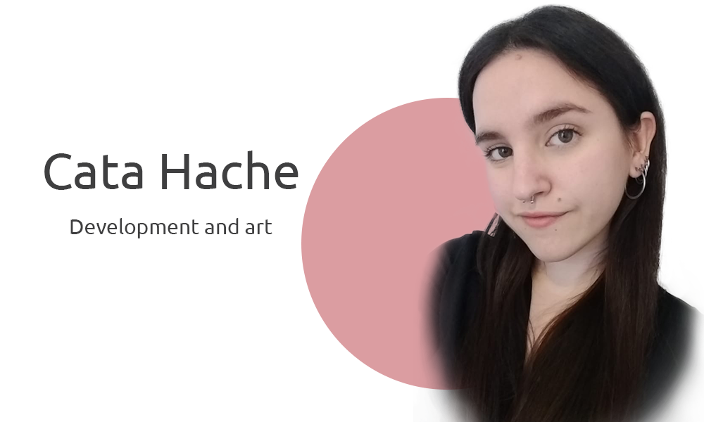

# Hello there! 😊 My name is Catalina

## 🤓 About me

---

I'm a **front end web developer**&nbsp; 💻 &nbsp; and **digital art curator**&nbsp; 🎨 &nbsp; based in Buenos Aires, Argentina.

I'm currently studying to achieve a Technical Programming Degree at **Universidad Tecnológica Nacional** and in **CoderHouse**, because I love coding and creating digital projects.

Feel free to contact me on [![Twitter][1.2]][1] or on [![LinkedIn][2.2]][2]&nbsp;!

<!-- Icons -->

[1.2]: images/logos/twitter.png "twitter"
[2.2]: images/logos/linkedin.png "LinkedIn"

<!-- Links -->

[1]: https://twitter.com/grlncrtl
[2]: https://www.linkedin.com/in/catalina-fernandez-heredia/

&nbsp;

## 🔧 Technologies and Tools

---

&nbsp;

## 📈 Github stats

---

 

 

 

<!--
**catahache/catahache** is a ✨ _special_ ✨ repository because its `README.md` (this file) appears on your GitHub profile.

Here are some ideas to get you started:

- 🔭 I’m currently working on ...
- 🌱 I’m currently learning ...
- 👯 I’m looking to collaborate on ...
- 🤔 I’m looking for help with ...
- 💬 Ask me about ...
- 📫 How to reach me: ...
- 😄 Pronouns: ...
- ⚡ Fun fact: ...
-->

<!-- Resources -->
<!-- Icons: https://simpleicons.org/ -->
<!-- GitHub Stats: https://github.com/anuraghazra/github-readme-stats -->
<!-- Emojis: https://emojipedia.org/emoji/ -->
<!-- HTML Emojis: https://www.fileformat.info/index.htm -->
<!-- Shields: https://shields.io/ -->
<!-- Awesome GitHub Profile README: https://github.com/abhisheknaiidu/awesome-github-profile-readme -->
